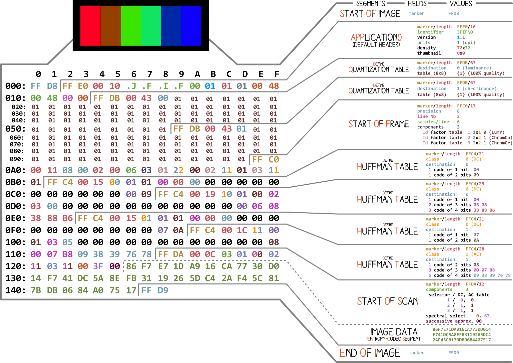

Usage: jpegify.py [OPTIONS] [INPUT_PATH]

Arguments:
[INPUT_PATH] [default: None]

Options:
--mse FLOAT
--help Show this message and exit.

input_path - calea spre imagine, daca nu este valida sau nu este data atunci se va folosi imagea default face() din datasets
mse - pragul pentru mean square error

Exemple de utilizare

$ python jpegify.py --mse 9e-6

$ python jpegify.py pisica.png

$ python jpegify.py pisica.png --mse 5e-5

In momentul actual de fapt nu exista "compresie", imaginea ramane aceeasi marime fiindca nu am implementat partea de lossy compression, deci pana acum doar "scad" calitatea imaginii. Voiam sa continui a face un encoder si decoder complet dar nu am avut timp. Mai mult progres in fisierul research.ipynb

1. Am aplicat algoritmul JFIF pe toate blocurile din imagine
2. Am extins la imagini color
3. Am implementat pragul de MSE

Todo:

- Huffman encoding with default huffman trees from T.81
- Compute huffman trees per image
- Compute Quantization tables per iamge
- Write image with metadata as seen in 
- Apply to videos with a codec
