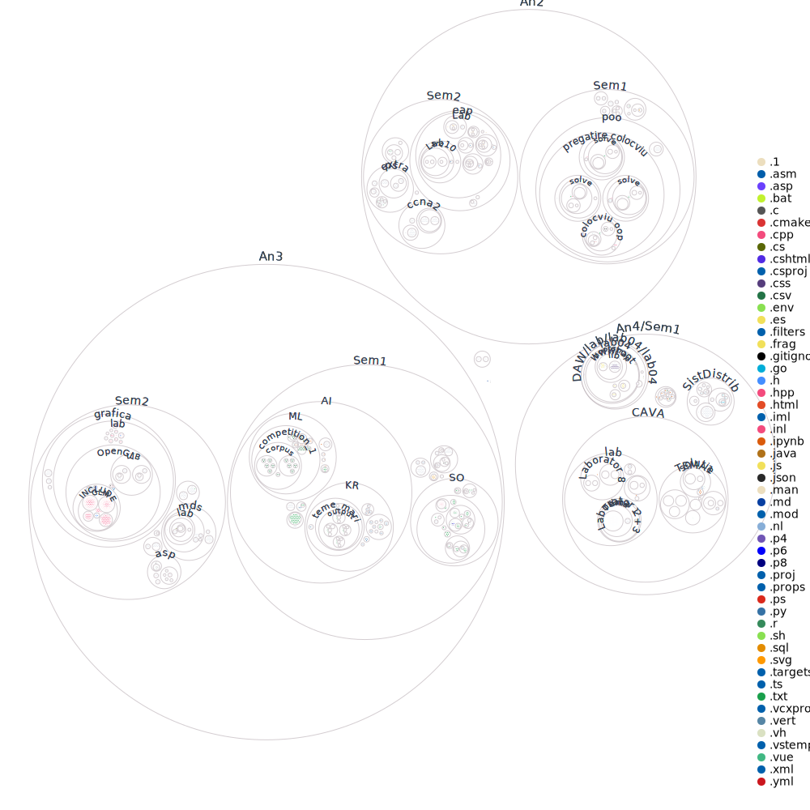

# facultate

Lista cu diverse resurse Unibuc CTI 2020-2024

Pentru orice fel de intrebare puteti sa ma contactati licu.mihai21@gmail.com

### Majoritatea proiectelor sunt adaugate drept submodule

Recomand `git clone --recurse-submodules -j8 https://github.com/lmihaig/facultate.git`

# Planul de invatamant (cu profesori)

Programa s-a schimbat mult dar asta e planul de invatamant pe care l-am urmat. Disclaimer: din cauza unui mic incident in anul 2020 toate materiile au fost in format strict ONLINE pana in Feb. 2022 (Anul 2 Semestrul 2).

| Anul I - Semestrul I |                                                             |       |      |                                   |                         |                                |
| :------------------: | :---------------------------------------------------------: | :---: | :--: | :-------------------------------: | :---------------------: | :----------------------------: |
|         Tip          |                   Discipline obligatorii                    |  FE   | Crd. |               Curs                |        Laborator        |            Seminar             |
|          DF          |           [Analiza matematica](An1/Sem1/analiza)            |   E   |  5   |      Mihail Alexandru Iancu       |                         |         Liliana Mitre          |
|          DF          |          [Algebra si geometrie](An1/Sem1/algebra)           |   E   |  5   |           Stanciu Miron           |                         |       Adrian Dan Halanay       |
|          DF          |         [Programarea calculatoarelor](An1/Sem1/pc)          |   V   |  5   |       Andrei Mihai Patrascu       | Marius Miculta Campeanu |           Oanea Smit           |
|          DD          |                  [Fizica](An1/Sem1/fizica)                  |   E   |  5   | Catalin Tatuta Cheche Tiberius |                         | Eduard Gatin Sorina Iftimie |
|          DD          |              [Proiectare logica](An1/Sem1/pl)               |   E   |  5   |          Cornel Nicolae           |     Cornel Nicolae      |                                |
|          DC          |     [Gandire critica si etica academica](An1/Sem1/gcea)     |   E   |  4   |        Tomi Paula Pompilia        |                         |          Remus Breazu          |
|          DC          | [Competente de baza intr-o limba straina](An1/Sem1/engleza) |   V   |  1   |        Protopopescu Daria         |                         |                                |
|          DC          |                       Educatie fizica                       |   V   |  2   |         Robert Sakizlian          |                         |                                |
|                      |                            Total                            | 5E+3V |  32  |                                   |                         |                                |

| Anul I - Semestrul II |                                                               |       |      |                        |                                  |                 |
| :-------------------: | :-----------------------------------------------------------: | :---: | :--: | :--------------------: | :------------------------------: | :-------------: |
|          Tip          |                    Discipline obligatorii                     |  FE   | Crd. |          Curs          |            Laborator             |     Seminar     |
|          DC           |                        Educatie fizica                        |   V   |  2   |    Robert Sakizlian    |                                  |                 |
|          DF           |              [Matematici speciale](An1/Sem2/ms)               |   E   |  5   | Mihail Alexandru Iancu |                                  |  Liliana Mitre  |
|          DF           |                 [Calcul numeric](An1/Sem2/cn)                 |   E   |  5   |  Sfetcu Razvan Cornel  |  Andreea-Paula Voinea-Marinescu  | Alexandru Ghita |
|          DF           |             [Tehnici de programare](An1/Sem2/tp)              |   E   |  5   |      Radu Boriga       |     Marius Miculta Campeanu      |                 |
|          DF           |     [Proiectare asistata de calculator](An1/Sem2/autocad)     |   E   |  5   |     Mihaita Dragan     |          Mihaita Dragan          |                 |
|          DD           |       [Utilizarea sistemelor de operare](An1/Sem2/uso)        |   V   |  5   |      Paul Irofti       |          Adriana Stancu          |                 |
|          DF           |             [Bazele electrotehnicii](An1/Sem2/be)             |   V   |  4   |     Cezar Tazloanu     | Cezar Tazloanu Sorina Iftimie |                 |
|          DC           | [Competente specifice intr-o limba straina](An1/Sem2/engleza) |   V   |  1   |   Protopopescu Daria   |                                  |                 |
|                       |                             Total                             | 4E+4V |  32  |                        |                                  |                 |

---

| Anul II - Semestrul I |                                                                |       |      |                                  |                                               |         |
| :-------------------: | :------------------------------------------------------------: | :---: | :--: | :------------------------------: | :-------------------------------------------: | :-----: |
|          Tip          |                     Discipline obligatorii                     |  FE   | Crd. |               Curs               |                   Laborator                   | Seminar |
|          DD           |         [Structuri de date si algoritmi](An2/Sem1/sda)         |   E   |  4   | Guillaume Jean Dominique Ducoffe |       Guillaume Jean Dominique Ducoffe        |         |
|          DD           |        [Programare orientata pe obiecte](An2/Sem1/poo)         |   E   |  5   |      Anca Madalina Dobrovat      |            Marius Miculta Campeanu            |         |
|          DD           |                  [Baze de date](An2/Sem1/bd)                   |   E   |  5   |     Silviu Laurentiu Vasile      |            Veronica Suzana Chirut             |         |
|          DD           |   [Fundamente ale retelelor de calculatoare](An2/Sem1/ccna1)   |   E   |  5   |          Mihaita Dragan          |                Mihaita Dragan                 |         |
|          DD           |       [Elemente de electronica analogica](An2/Sem1/eea)        |   E   |  5   |           Mihai Dinca            |         Bogdan Bita Adrian Apostu          |         |
|          DF           |                [Teoria sistemelor](An2/Sem1/ts)                |   E   |  5   |           Mihai Dinca            | Alecsandru Vladimir Chirosca Sandel Simion |         |
|          DC           | [Competente avansate intr-o limba straina I](An2/Sem1/engleza) |   V   |  1   |        Protopopescu Daria        |                                               |         |
|                       |                             Total                              | 6E+1V |  30  |                                  |                                               |         |

| Anul II - Semestrul II |                                                                |       |      |                              |                              |                 |
| :--------------------: | :------------------------------------------------------------: | :---: | :--: | :--------------------------: | :--------------------------: | :-------------: |
|          Tip           |                     Discipline obligatorii                     |  FE   | Crd. |             Curs             |          Laborator           |     Seminar     |
|           DF           |           [Probabilitati si statistica](An2/Sem2/ps)           |   E   |  5   |       Monica Patriche        |        Simona Cojocea        | Monica Patriche |
|           DS           |        [Elemente avansate de programare](An2/Sem2/eap)         |   E   |  6   |     Cristina Dascalescu      |        Andreea Farcas        |                 |
|           DS           |       [Fundamente ale rutarii in retea](An2/Sem2/ccna2)        |   E   |  5   |   Silviu laurentiu Vasile    |        Mihaita Dragan        |                 |
|           DD           |              [Electronica digitala](An2/Sem2/ed)               |   E   |  5   | Alecsandru Vladimir Chirosca |         Bogdan Bita          |                 |
|           DD           |       [Calculatoare numerice](An2/Sem2/calculatoarenum)        |   E   |  5   |       Alexandru Nemnes       | Alecsandru Vladimir Chirosca |                 |
|           DC           | [Managementul si dezvoltarea carierei](An2/Sem2/mandezcariera) |   V   |  3   |        Iuliana Josan         |                              |  Iuliana Josan  |
|           DC           |          Competente avansate intr-o limba straina II           |   V   |  1   |      Protopopescu Daria      |                              |                 |
|                        |                             Total                              | 5E+2V |  30  |                              |                              |                 |

---

| Anul III - Semestrul I |                                                      |       |      |                          |                                   |              |
| :--------------------: | :--------------------------------------------------: | :---: | :--: | :----------------------: | :-------------------------------: | :----------: |
|          Tip           |                Discipline obligatorii                |  FE   | Crd. |           Curs           |             Laborator             |   Seminar    |
|           DD           |     [Proiectarea bazelor de date](An3/Sem1/pbd)      |   E   |  6   |     Florentin Ipate      |      Marius Miculta Campeanu      |  Radu Bobe   |
|           DD           |          [Sisteme de operare](An3/Sem1/SO)           |   E   |  6   | Dumitru Daniel Dragulici |     Dumitru Daniel Dragulici      |              |
|           DD           |        [Inteligenta artificiala](An3/Sem1/AI)        |   E   |  6   |       Bogdan Alexe       | Alexandra Diaconu Irina Ciocan |              |
|           DD           |   [Arhitectura sistemelor de calcul](An3/Sem1/ASC)   |   E   |  5   |    Florin Stanculescu    |   Alecsandru Vladimir Chirosca    |              |
|           DC           | [Comunicare si relatii publice](An3/Sem1/comunicare) |   V   |  2   |       Catalin Radu       |                                   | Catalin Radu |
|           DS           |        [Cloud Computing](An3/Sem1/CloudComp)         |   E   |  5   |   Cristian Kevorchian    |           Bogdan Ghimis           |              |
|                        |                        Total                         | 5E+1V |  30  |                          |                                   |              |

| Anul III - Semestrul II |                                                         |       |      |                              |                              |                          |
| :---------------------: | :-----------------------------------------------------: | :---: | :--: | :--------------------------: | :--------------------------: | :----------------------: |
|           Tip           |                 Discipline obligatorii                  |  FE   | Crd. |             Curs             |          Laborator           |         Seminar          |
|           DS            | [Criptografie si Securitate](An3/Sem2/CriptoSecuritate) |   E   |  4   |         Radu Boriga          |      Paul Adrian Cotan       |                          |
|           DC            |             [Marketing](An3/Sem2/marketing)             |   V   |  2   |   Stefan Alexandru Catana    |                              | Stefan Alexandru Catana  |
|           DS            |        [Grafică pe calculator](An3/Sem2/grafica)        |   E   |  4   |     Mihai Sorin Stupariu     |      Alexandra Diaconu       |    Alexandra Diaconu     |
|           DS            |      [Metode de dezvoltare software](An3/Sem2/mds)      |   E   |  4   |     Cristian Kevorchian      |   Marius Iulian Mihailescu   | Marius Iulian Mihailescu |
|           DD            | [Sisteme cu microprocesoare](An3/Sem2/microprocesoare)  |   E   |  4   | Alecsandru Vladimir Chirosca | Alecsandru Vladimir Chirosca |                          |
|           DS            |     [Arhitectura sistemelor paralele](An3/Sem2/asp)     |   E   |  4   |          Lucian Ion          |       Geanina Chirosca       |                          |
|           DD            |                  Practică industrială                   |   V   |  8   |        Deutsche Bank         |        Deutsche Bank         |      Deutsche Bank       |
|                         |                          Total                          | 5E+2V |  30  |

---

| Anul IV - Semestrul I |                                                               |       |      |                              |                          |                  |
| :-------------------: | :-----------------------------------------------------------: | :---: | :--: | :--------------------------: | :----------------------: | :--------------: |
|          Tip          |                    Discipline obligatorii                     |  FE   | Crd. |             Curs             |        Laborator         |     Seminar      |
|          DD           |         [Sisteme Distribuite](An4/Sem1/SistDistrib/)          |   E   |  6   |    Andrei Mihai Patrascu     | Marius Iulian Mihailescu |                  |
|          DD           |          [Ingineria Programarii](An4/Sem1/IngProg/)           |   E   |  6   |       Radu Gramatovici       |                          | Radu Gramatovici |
|          DS           |         [Dezvoltarea Aplicatiilor Web](An4/Sem1/DAW/)         |   E   |  4   |        Petru Soviany         |      Petru Soviany       |                  |
|          DS           |              [Comert Electronic](An4/Sem1/ECom/)              |   E   |  4   |        Mihail Cherciu        |      Mihail Cherciu      |                  |
|          DC           |              [Management](An4/Sem1/management/)               |   V   |  2   |       Cristian Anghel        |                          | Cristian Anghel  |
|          DS           | [Concepte si Aplicatii in Vederea Artificiala](An4/Sem1/CAVA) |   E   |  4   | Bogdan Alexe Radu Ionescu |    Alexandra Diaconu     |                  |
|          DD           |          [Procesarea Semnalelor](An4/Sem1/ProcSemn/)          |   E   |  4   |        Cristian Rusu         |                          |  Cristian Rusu   |
|                       |                             Total                             | 6E+1V |  30  |

| Anul IV - Semestrul II |                                                                   |       |      |      |           |         |
| :--------------------: | :---------------------------------------------------------------: | :---: | :--: | :--: | :-------: | :-----: |
|          Tip           |                      Discipline obligatorii                       |  FE   | Crd. | Curs | Laborator | Seminar |
|           DS           | [Elemente de securitate si logica aplicata](An4/Sem2/Securitate/) |   E   |  6   |      |           |         |
|           DC           |       [Managementul operatiunilor](An4/Sem2/managementOP/)        |   V   |  2   |      |           |         |
|           DD           |                              indecis                              |   E   |  4   |      |           |         |
|           DD           |      [Compilatoare si Translatoare](An4/Sem2/compilatoare/)       |   E   |  4   |      |           |         |
|           DD           |   [Testarea Sistemelor Software](An4/Sem2/TestareaSistemelor/)    |   E   |  4   |      |           |         |
|           DS           |             [Pregatirea proiectului de diploma](aici)             |   E   |  4   |      |           |         |
|                        |                               Total                               | 4E+2V |  30  |
|           E            |                     [Examen de diploma](aici)                     |   E   |  10  |      |           |         |

